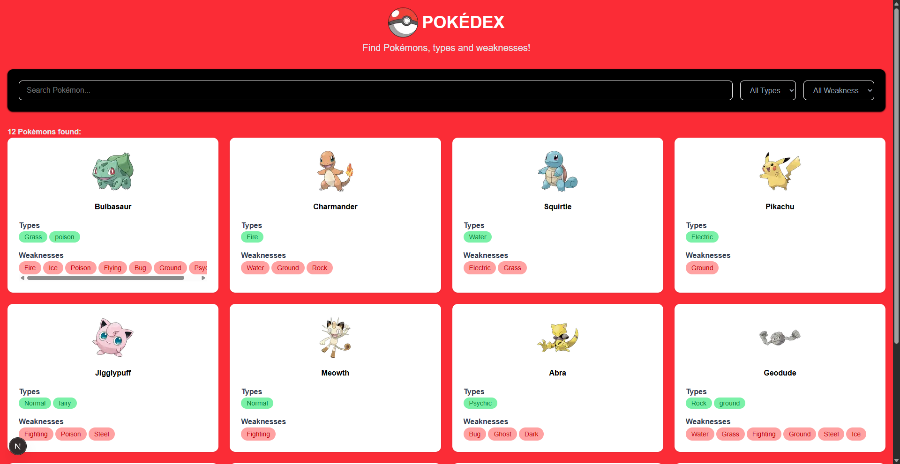

# 🧩 Pokédex

Uma aplicação web desenvolvida com **Next.js**, **React** e **TypeScript** para consultar Pokémons, calcular automaticamente suas fraquezas e realizar buscas e filtros de forma simples e intuitiva.

Este projeto foi desenvolvido como parte de um desafio técnico com foco em consumo de APIs, manipulação de dados, organização de código e boas práticas no desenvolvimento de aplicações Full Stack.

---

## 🚀 Demonstração

🌐 **Aplicação:** https://SEU-PROJETO.vercel.app

---

## 📸 Preview



---

## ✨ Funcionalidades

* 🔍 Busca de Pokémon por nome
* 🏷️ Filtro por tipo
* ⚔️ Filtro por fraqueza
* 📋 Listagem dos Pokémons
* 🧠 Cálculo automático das fraquezas com base nos tipos
* ⚡ Consumo de API utilizando `fetch`
* 📱 Interface responsiva
* ⏳ Tratamento de estados de carregamento
* ❌ Tratamento de erros na requisição

---

## 🛠️ Tecnologias

* **Next.js 15**
* **React**
* **TypeScript**
* **Tailwind CSS**
* **Next/Image**
* **API Routes do Next.js**

---

## 📁 Estrutura do Projeto

```text
src
│
├── app
│   ├── api
│   │   └── pokemons
│   │       └── route.ts
│   ├── layout.tsx
│   └── page.tsx
│
├── components
│   ├── Filters.tsx
│   ├── PokemonCard.tsx
│   └── SearchBar.tsx
│
├── data
│   └── pokemons.json
│
├── hooks
│   └── usePokemons.ts
│
├── lib
│   └── weaknesses.ts
│
├── services
│   └── pokemonService.ts
│
└── types
    └── pokemon.ts
```

---

## 🏗️ Organização

O projeto foi estruturado com separação de responsabilidades para facilitar manutenção e escalabilidade.

| Pasta           | Responsabilidade                              |
| --------------- | --------------------------------------------- |
| **app/**        | Páginas e rotas da aplicação                  |
| **components/** | Componentes reutilizáveis da interface        |
| **hooks/**      | Gerenciamento de estado e lógica da aplicação |
| **services/**   | Comunicação com a API                         |
| **lib/**        | Funções utilitárias (cálculo de fraquezas)    |
| **data/**       | Base de dados utilizada pela API              |
| **types/**      | Interfaces e tipagens do projeto              |

---

## 🔄 Fluxo da Aplicação

```text
Frontend
     │
     ▼
GET /api/pokemons
     │
     ▼
API Route (Next.js)
     │
     ▼
pokemons.json
     │
     ▼
Pokemon Service
     │
     ▼
Cálculo das fraquezas
     │
     ▼
Hook (usePokemons)
     │
     ▼
Filtros
     │
     ▼
Renderização da interface
```

---

## ⚙️ Como executar o projeto

Clone o repositório:

```bash
git clone https://github.com/suarestalles/pokedex.git
```

Acesse a pasta do projeto:

```bash
cd SEU-REPOSITORIO
```

Instale as dependências:

```bash
npm install
```

Execute o projeto:

```bash
npm run dev
```

A aplicação estará disponível em:

```text
http://localhost:3000
```

---

## 💡 Decisões de Implementação

Durante o desenvolvimento foram adotadas algumas decisões para manter o código organizado e de fácil manutenção:

* Utilização das **API Routes do Next.js**, evitando a necessidade de um backend separado.
* Criação de um **Service** responsável pela comunicação com a API.
* Implementação de um **Hook Customizado (`usePokemons`)** para centralizar regras de negócio e gerenciamento de estado.
* Separação da lógica de cálculo das fraquezas em uma função utilitária.
* Componentização da interface para facilitar reutilização e manutenção.
* Uso do **TypeScript** para garantir maior segurança durante o desenvolvimento.

---

## 🚧 Melhorias Futuras

* 🎨 Cores específicas para cada tipo de Pokémon
* 🔃 Ordenação por nome ou número da Pokédex
* 📄 Paginação ou carregamento incremental
* 🌐 Consumo de uma API externa
* 🧪 Testes unitários e de integração
* ♿ Melhorias de acessibilidade
* ✨ Animações e transições

---

## 👨‍💻 Autor

Desenvolvido por **Talles Suares**.

Se quiser conversar sobre este projeto ou trocar experiências sobre desenvolvimento, fique à vontade para entrar em contato.

---

⭐ Se este projeto foi interessante para você, fique à vontade para deixar uma estrela no repositório!
